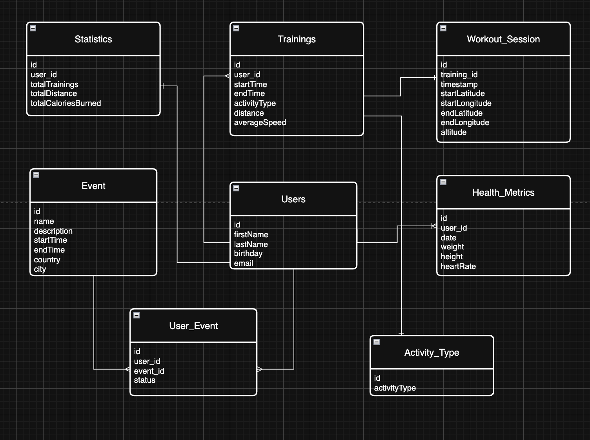

Laboratorium II - Relacje w JPA - stan na 8.11.2025

**Uwaga - Przed przystapieniem do zadania proszę o wykonanie zadania LAB01 (poprzednie zajęcia). **

1. Zsynchronizuj swoje repozytorium z repozytorium prowadzącego (Sync Fork bądź Pull z repozytorium prowadzącego). Można
   wykonać to bezpośrednio w GitHubie lub lokalnie.
2. Do projektu dodaj plik github-ci-cd.yml. Plik ten znajduje się w katalogu resources/JPA/LAB02/github-ci-cd.yml.
   Plik powinien zostać umieszczony pod .github/workflows/github-ci-cd.yml
3. Scommituj zmiany i wyślij je do swojego repozytorium. Zweryfikuj czy projekt poprawnie się buduje na Github (zakładka
   Actions)
4. Przenieś klasę DatabaseSchemaTest.java z folderu resources/JPA/LAB02/DatabaseSchemaTest do katalogu testowego (
   src/test/java/pl/wsb/fitnesstracker).
5. Scommituj zmiany i wyślij je do swojego repozytorium.
6. Zweryfikuj czy projekt poprawnie się buduje na Github. Test nie powinny poprawnie przechodzić
7. Zapoznaj się z poniższym schematem relacyjnym bazy danych. Korzystając z wiedzy przekazanej na wykładzie, literatury
   oraz internetu, uzupełnij brakujące tabele i relacje w aktualnej definicji encji (zwróć uwagę także na nazwy tabel
   oraz brakujące kolumny).
   Określ nullowalność oraz nazwy kolumn. Ustaw relacje tak, aby przynajmniej raz była wykorzystana relacja
   jednostronna (OneToOne)
   oraz ManyToOne. **Pracujemy nad 3 Encjami Statistics, HealthMetrics, User.**

   

8. Wprowadzone zmiany prześlij na swoje repozytorium. Testy powinny poprawnie się wykonać lokalnie oraz platformie
   Github.
9. Zgłoś prowadzącemu wykonanie zadanie, celem uzyskania oceny.

10. (*) Opcjonalnie można przygotować plik data.sql z danymi (komendy INSERT) w odpowiedniej kolejności, potwierdzając
    poprawność modelu.
    Przydadzą się na kolejnych zajęciach.

Kryterium Akceptacji na ocenę 5:

- Poprawnie zdefiniowane 3 encje JPA (tabele, kolumny, relacje, nullowalność)
- Poprawnie działające testy jednostkowe (DatabaseSchemaTest) - również na Github Actions
- GitHub Actions z poprawnym buildem projektu po kroku 7.
- Przesłanie zmian na na swoje repozytorium.

Kryterium Akceptacji na ocenę 4:

- Poprawnie zdefiniowane 2 encje JPA (tabele, kolumny, relacje, nullowalność)
- Poprawnie działające testy jednostkowe związane z encjami (DatabaseSchemaTest) - również na Github Actions
- GitHub Actions z poprawnym buildem projektu po kroku 7.
- Przesłanie zmian na na swoje repozytorium.

Kryterium Akceptacji na ocenę 3:

- Poprawnie zdefiniowana 1 encja JPA (tabele, kolumny, relacje, nullowalność)
- Zsynchronizowane repozytorium z repozytorium prowadzącego
- GitHub Actions z poprawnym buildem projektu po kroku 3.
- Przesłanie zmian na na swoje repozytorium.